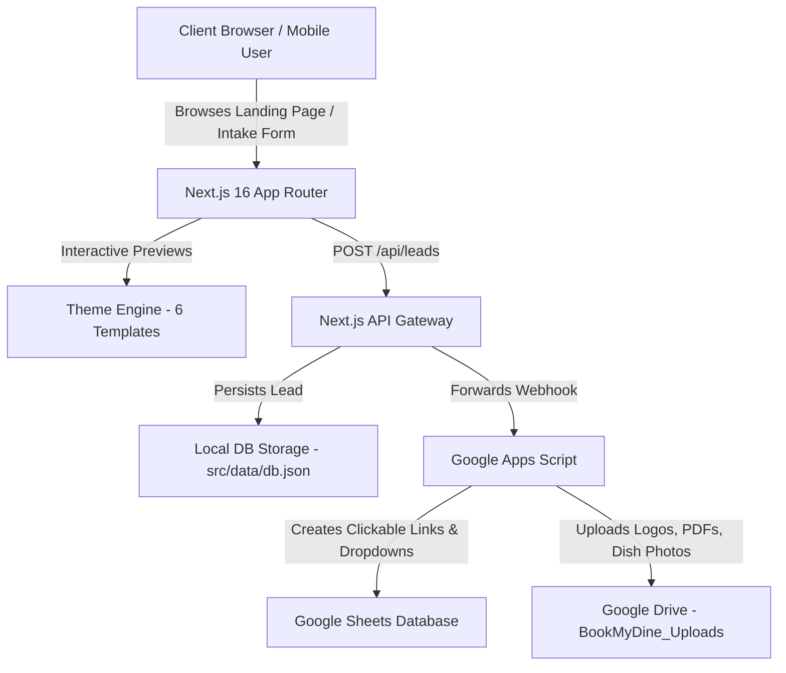

<div align="center">

  <br />
  
  <div style="background-color: #0f623f; padding: 20px; border-radius: 16px; display: inline-block;">
    <h1 align="center" style="color: #ffffff; margin: 0; font-size: 2.2rem; font-weight: 900;">
      🍽️ BookMyDine<span style="opacity: 0.7; font-weight: 300;">QR</span>
    </h1>
  </div>

  <p align="center">
    <b>Enterprise Done-For-You Managed Digital QR Menu Platform</b>
    <br />
    <i>One Scan. Their Perfect Meal.</i>
  </p>

  <p align="center">
    <a href="https://nextjs.org"></a>
    <a href="https://www.typescriptlang.org"></a>
    <a href="https://tailwindcss.com"></a>
    <a href="https://developers.google.com/apps-script"></a>
    <a href="#-commercial-license--terms"></a>
  </p>

  <br />
</div>

---

## 📌 Table of Contents

- [Overview](#-overview)
- [Key Features](#-key-features)
- [Architecture & Tech Stack](#-architecture--tech-stack)
- [The 6 Premium Theme Presets](#-the-6-premium-theme-presets)
- [Google Sheets & Drive Automation](#-google-sheets--drive-automation)
- [Installation & Local Setup](#-installation--local-setup)
- [Environment Configuration](#-environment-configuration)
- [Commercial License & Terms](#-commercial-license--terms)
- [Contact & Support](#-contact--support)

---

## 📖 Overview

**BookMyDine QR** is a full-stack Next.js SaaS solution designed for cafes, fine dining establishments, authentic Indian thali joints, food trucks, and night lounges. 

Unlike self-serve drag-and-drop tools that confuse restaurant owners, BookMyDine QR operates as a **Done-For-You Managed Digital Menu Service**. Restaurant owners submit their menu via a streamlined 3-step intake form, while our backend handles design formatting, custom QR stand generation, and menu hosting.

---

## ✨ Key Features

### 🎨 1. 6 Professionally Curated Themes
- **Minimalist Cafe**: Neutral warm tones for coffee shops & bakeries.
- **Executive Fine Dining**: Obsidian & metallic gold accents.
- **Heritage Indian**: Terracotta & warm amber aesthetic for authentic thali & tandoori.
- **Modern Bistro**: Forest green highlights for modern dining.
- **Street Food Express**: Energetic red & yellow for QSR & food trucks.
- **Premium Dark Lounge**: WebGL animated dark mode for night bars & pubs.

### 📱 2. Interactive Device Mockup Switcher
- Live side-by-side preview allowing restaurant owners to toggle between **Mobile Smartphone View** and **Tablet View** with smooth scroll controls.

### 💳 3. Annual Billing & Discount Controls
- Flexible **Monthly Billing** vs. **Annual Billing (2 Months FREE)** toggle switch.
- Dynamic discount notifications and breakdown calculation (`~₹82/month` on annual starter).

### ⚡ 4. Real-Time Google Sheets & Drive Webhook
- Form submissions are forwarded to a custom **Google Apps Script Webhook**.
- **Smart Row Reuse**: Automatically fills the first empty row if old entries are deleted.
- **Status Dropdowns**: Interactive in-cell statuses (`New Lead`, `Contacted`, `Preview Sent`, `Approved`, `Cancelled`).
- **Direct WhatsApp Chat Links**: 1-click `=HYPERLINK()` launching direct WhatsApp conversations with owner numbers.
- **Google Drive Auto-Uploader**: Automatically saves uploaded Logos, PDFs, and Food Photos into a Google Drive folder (`BookMyDine_Uploads`) and inserts clickable links into Google Sheets.

---

## 🏗️ Architecture & Tech Stack



### Core Technologies:
- **Framework**: [Next.js 16 (Turbopack Engine)](https://nextjs.org/)
- **Language**: [TypeScript 5](https://www.typescriptlang.org/)
- **Styling**: Vanilla TailwindCSS with responsive glassmorphism and modern typography.
- **Icons**: Lucide React
- **Backend Integrations**: Google Apps Script Webhooks, Google Drive API

---

## 🎨 The 6 Premium Theme Presets

| Theme | Best Suited For | Key Aesthetic |
| :--- | :--- | :--- |
| **Minimalist Cafe** | Artisanal Cafes, Bakeries | Neutral beige, warm dark brown `#CA7857` |
| **Executive Fine Dining** | Upscale Restaurants | Deep obsidian `#131313`, metallic gold `#E5C276` |
| **Heritage Indian** | Thali & Tandoori Outlets | Deep terracotta `#5D181B`, warm amber `#7C580A` |
| **Modern Bistro** | Contemporary Bistros | Crisp white `#FFFFFF`, forest green `#4B6549` |
| **Street Food Express** | Fast Food & Stalls | Energetic red `#AC2C23`, yellow `#FFCE5E` |
| **Premium Dark Lounge** | Night Clubs, Pubs & Bars | Dark zinc `#18181B`, cyan glow `#46D9E8` |

---

## 🤖 Google Sheets & Drive Automation

All backend logic for Google Sheets integration is contained in [`script.txt`](file:///d:/BOOK%20MY%20Slot/book%20my%20dine/qr_menu_SAAS/script.txt).

### Quick Setup Steps:
1. Open Google Sheets $\rightarrow$ **Extensions** $\rightarrow$ **Apps Script**.
2. Copy code from [`script.txt`](file:///d:/BOOK%20MY%20Slot/book%20my%20dine/qr_menu_SAAS/script.txt) and paste it into the editor.
3. Select **`initialSetup`** from the top dropdown menu and click **Run** (this creates the emerald header row and Google Drive folder).
4. Click **Deploy** $\rightarrow$ **New deployment** $\rightarrow$ Web App (Access: *Anyone*).
5. Copy the Web App URL into your `.env.local` file:
   ```env
   GOOGLE_SHEETS_WEBHOOK_URL="https://script.google.com/macros/s/YOUR_DEPLOYMENT_ID/exec"
   ```

---

## 💻 Installation & Local Setup

```bash
# 1. Clone the repository
git clone https://github.com/Tusharjain-19/BOOKMYDINE_QR.git
cd BOOKMYDINE_QR

# 2. Install dependencies
npm install

# 3. Setup environment configuration
cp .env.example .env.local

# 4. Start development server
npm run dev
```

Visit `http://localhost:3000` to view the application live.

---

## 🔒 Commercial License & Terms

> [!CAUTION]
> **STRICT COMMERCIAL RESTRICTIONS APPLY**

This repository is protected under a **Proprietary & Non-Commercial Source-Available License**.

- **Allowed**: Personal evaluation, educational inspection, code review, and non-commercial learning.
- **Strictly Prohibited**: Selling, reselling, sublicensing, white-labeling, commercial hosting, or offering digital menu services for commercial gain derived from this codebase without prior written authorization from **BookMySlot Tech Services**.

For commercial licensing requests, enterprise partnerships, or white-label inquiries, please refer to the [`LICENSE`](file:///d:/BOOK%20MY%20Slot/book%20my%20dine/qr_menu_SAAS/LICENSE) file or contact us directly.

---

## 📞 Contact & Support

- **Brand**: BookMyDine QR (by BookMySlot Tech Services)
- **Headquarters**: Rajasthan / All India Operations
- **Email**: `teambookmydine@gmail.com`
- **WhatsApp Support**: `+91 8005737183`
- **Official Web App**: [BookMyDine QR](https://github.com/Tusharjain-19/BOOKMYDINE_QR)

---

<div align="center">
  <sub>Built with ❤️ by BookMySlot Tech Services</sub>
</div>
